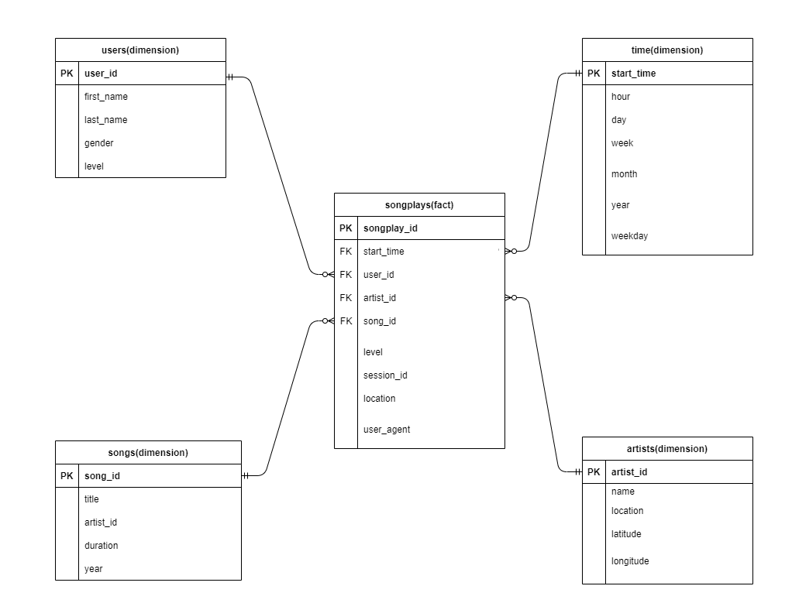

# **Implementing Data Lake with Apache Spark**

## Table of contents

* [Project Summary](#Project-Summary)
* [Project Description](#Project-Description)
* [Project Datasets](#Project-Datasets)
* [Schema for Song Play Analysis](#Schema-for-Song-Play-Analysis)
* [Files](#Files)

# Project Summary
The Project involves creation of a database schema and ETL pipeline for the Sparkify.
Sparkify is a music streaming startup which has grown their user base and song database and want to move their processes and data onto the cloud. Their data resides in **S3, in a directory of JSON logs** on user activity on the app, as well as a **directory with JSON metadata** on the songs in their app.

# **Project Description**
In these project we will create an ETL pipeline that extracts their data from **S3**, processes them using **Spark**, and loads the data back into S3 as **a set of dimensional tables** to find what songs their users are listening to. To complete the project, you will need to load data from S3, process the data into analytics tables using Spark, and load them back into S3. You'll deploy this Spark process on a cluster using AWS.

# **Project Datasets**
The data for this project is available on Amazon S3.
- Song data: s3://udacity-dend/song_data
- Log data: s3://udacity-dend/log_data

## **Song Dataset**
The first dataset is a subset of real data from the Million Song Dataset. Each file is in JSON format and contains metadata about a song and the artist of that song. The files are partitioned by the first three letters of each song's track ID. For example, here are filepaths to two files in this dataset.
```
song_data/A/B/C/TRABCEI128F424C983.json
song_data/A/A/B/TRAABJL12903CDCF1A.json
```
And below is an example of what a single song file, TRAABJL12903CDCF1A.json, looks like.
```
{"num_songs": 1, "artist_id": "ARJIE2Y1187B994AB7", "artist_latitude": null, "artist_longitude": null, "artist_location": "", "artist_name": "Line Renaud", "song_id": "SOUPIRU12A6D4FA1E1", "title": "Der Kleine Dompfaff", "duration": 152.92036, "year": 0}
```

## **Log Dataset**
The second dataset consists of log files in JSON format generated by this event simulator based on the songs in the dataset above. These simulate activity logs from a music streaming app based on specified configurations.
The log files in the dataset you'll be working with are partitioned by year and month. For example, here are filepaths to two files in this dataset.
```
log_data/2018/11/2018-11-12-events.json
log_data/2018/11/2018-11-13-events.json
```


## **Schema for Song Play Analysis**
Using the song and log datasets, you'll need to create a star schema optimized for queries on song play analysis. This includes the following tables.

**Fact Table**
1. **songplays** - records in log data associated with song plays i.e. records with page **NextSong**
  -songplay_id, start_time, user_id, level, song_id, artist_id, session_id, location, user_agent

**Dimension Tables**

2. **users** - users in the app
  - user_id, first_name, last_name, gender, level

3. **songs** - songs in music database
  - user_id, first_name, last_name, gender, level

4. **artists** - artists in music database
  - artist_id, name, location, latitude, longitude

5. **time** - timestamps of records in **songplays** broken down into specific units
  - start_time, hour, day, week, month, year, weekday

The above mentioned tables can be interpreted using below Entity Relationship Diagrams (ERD) :



## **Files**
- `etl.py`

  Reads data from S3, processes that data using Spark, and writes them back to S3

- `dl.cfg`

  Contains the AWS credentials
